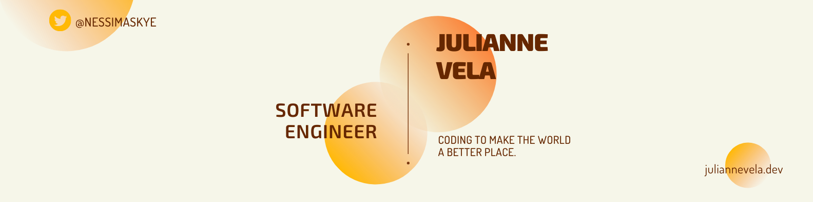
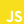

<link rel="preconnect" href="https://fonts.gstatic.com">
<link href="https://fonts.googleapis.com/css2?family=Dosis&family=Exo+2:wght@500;900&display=swap" rel="stylesheet">

<h1 style="font-size:28px; font-family: 'Exo 2', sans-serif; font-weight:900" align="center">
    Hello. I'm Juli. Nice to meet you!
</h1>

<section class="about" align="left">
    <h2 style="font-size:24px; font-family: 'Exo 2', sans-serif; font-weight:500">
        A little about me
    </h2>
    

        I'm a neurodivergent full-stack software engineer. I code to help save the planet, raise awareness for mental health, and encourage other neurodiverse womxn! Please feel free to reach out to me at any of my contacts below. 
         Happy Coding! :)
          
        <strong>Currently Learning:</strong> 
            <ul style="font-size:18px; font-family: 'Dosis', sans-serif">
                <li>
                    
                    GraphQL
                </li>
                <li>
                    
                    React Native
                </li>
                <li>
                    
                    Sequelize
                </li>
                <li>
                    
                    Python3
                </li>
            </ul>
    

</section>

<section class="jokes" align="right">
    <h2 style="font-size:28px; font-family: 'Exo 2', sans-serif; font-weight:900"> 
        Some Programming Humor for you 
        
    </h2>
        
</section>

<table class="connect">
<thead>
  <tr>
    <th colspan="2" style="font-size:28px; font-family: 'Exo 2', sans-serif;">
        Connect With Me
        
    </th>
  </tr>
</thead>
<tbody>
  <tr>
    <td>
        
    </td>
    <td style="font-size: 18px; font-family: 'Dosis';">
        <a href="https://www.linkedin.com/in/juliannevela" target="_blank" rel="noopener noreferrer">
            @juliannevela
        </a>
    </td>
  </tr>
  <tr>
    <td>
        
    </td>
    <td style="font-size: 18px; font-family: 'Dosis';">
        <a href="https://www.twitter.com/NessimaSkye" target="_blank" rel="noopener noreferrer">
            @NessimaSkye
        </a>
    </td>
  </tr>
  <tr>
    <td>
        
    </td>
    <td style="font-size: 18px; font-family: 'Dosis';">
        <a href="https://www.github.com/julianne-vela" target="_blank" rel="noopener noreferrer">
            @julianne-vela
        </a>
    </td>
  </tr>
</tbody>
</table>
 

<table class="tech-skills" align="right">
    <thead>
        <tr>
            <th style="font-size:28px; font-family: 'Exo 2', sans-serif; font-weight:900" colspan="4">
                Skills &amp; Tech
            </th>
        </tr>
    </thead>
    <tbody>
        <tr>
            <td style="font-size:18px; font-family: 'Dosis', sans-serif">Languages</td>
            <td colspan="3">
                
                
                
                
                
            </td>
        </tr>
        <tr>
            <td style="font-size:18px; font-family: 'Dosis', sans-serif">
                Libraries &amp; Frameworks
            </td>
            <td colspan="3">
                
                
                
                
            </td>
        </tr>
        <tr>
            <td style="font-size:18px; font-family: 'Dosis', sans-serif">
                Tools
            </td>
            <td colspan="3">
                
                
                
                
                
                
            </td>
        </tr>
        <tr>
            <td style="font-size:18px; font-family: 'Dosis', sans-serif">
                Continuous Delivery
            </td>
            <td colspan="3">
                
                
            </td>
        </tr>
        <tr>
            <td style="font-size:18px; font-family: 'Dosis', sans-serif">
                OS
            </td>
            <td colspan="3">
                
                
                
            </td>
        </tr>
    </tbody>
</table>

             

<section class="stats" align="left">
    <h2 style="font-size:28px; font-family: 'Exo 2', sans-serif; font-weight:900"> 
        My GitHub Stats 
    </h2>
    
        
    <em style="font-size: 14px; font-family: 'Dosis'; display: inline-block;">NOTE: Top Languages does not indicate my skill level or anything like that, it's a GitHub metric of which languages have the most code on GitHub. It's a new feature of github-readme-stats.</em>
</section>

<!-- BLOG-POST-LIST:START -->
<!-- BLOG-POST-LIST:END -->
